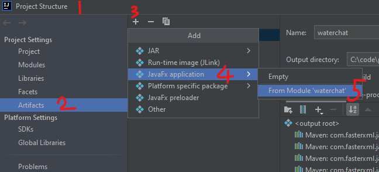
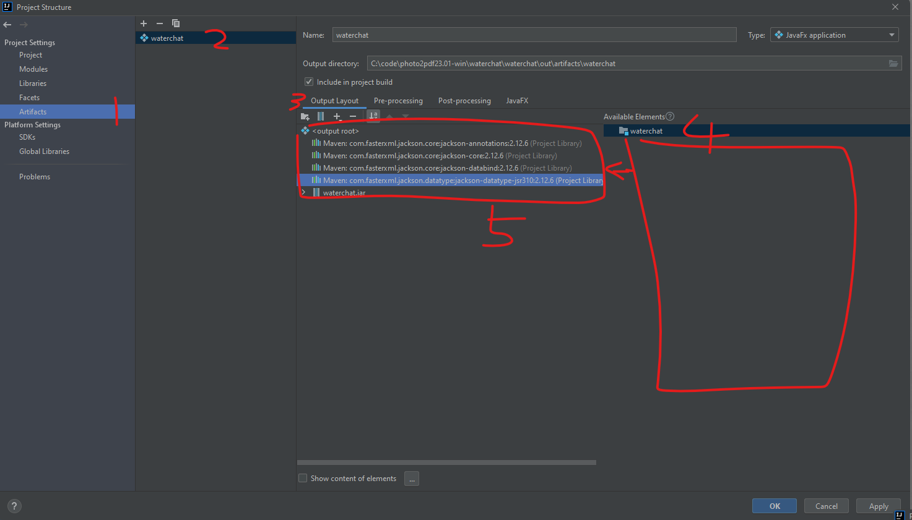
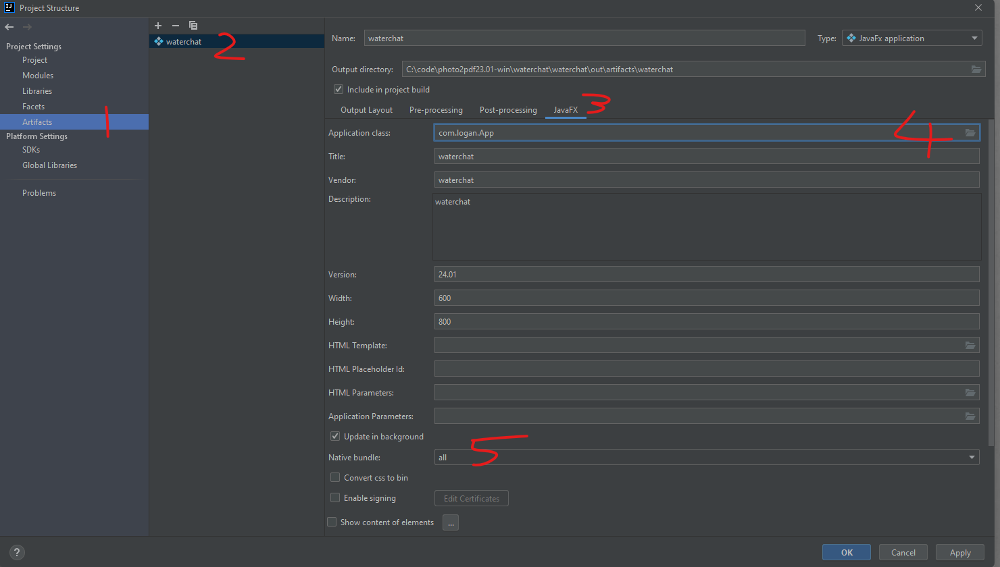
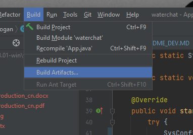
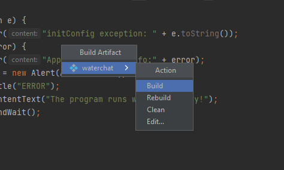

# README_DEV

## 环境
* 运行和构建项目环境 -- JDK8, maven3.5.4, intellij idea 2020.3
* 在windows电脑构建可安装 .exe 文件时需要的环境 -- JDK17
* 以下文件需要您自行下载或者生成,因为github限制了文件大于100MB的文件上传（重要！！！）。
  1. src/main/resources/models/Qwen2-0.5B-Instruct/model.safetensors，
  需要您到链接 https://huggingface.co/Qwen/Qwen2-0.5B-Instruct/tree/main 下载model.safetensors ，
  然后放到src/main/resources/models/Qwen2-0.5B-Instruct/  文件夹之下。
  2. 如果你是在windows使用，src/main/resources/modelsexec/call_chat_v1.exe 的call_chat_v1.exe需要您根据以下 “#### python3 环境特别说明
     ”部分自行生成 call_chat_v1.exe 然后放到 src/main/resources/modelsexec/ 文件夹之下。
  3. 如果你是在mac使用，src/main/resources/modelsexec/call_chat_v1 的call_chat_v1.exe需要您根据以下 “#### python3 环境特别说明
     ”部分自行生成 call_chat_v1 然后放到 src/main/resources/modelsexec/ 文件夹之下。

## 包装你自己的AI模型
以下皆以包装 https://huggingface.co/Qwen/Qwen2-72B-Instruct 进行举例。

### 1须知
* 仅支持hugging face的transformers支持的AI对话模型。更具体的说你的模型要能够被
   model = AutoModelForCausalLM.from_pretrained(
  "{your model here}",
  torch_dtype="auto",
  device_map="auto"
  )
加载， 并且消息支持apply_chat_template的调用方式
  tokenizer.apply_chat_template(
  messages,
  tokenize=False,
  add_generation_prompt=True
  )
 才可以用本应用包装你的AI模型。具体可以查看本项目 resources/asset/ 目录下的chat_5_v3.py python脚本查看具体逻辑。
### 2 环境准备
* python3(全部从头开始了解本项目，才需要python3环境)
* java8、java17
* IntelliJ IDEA
* maven 3.5.4

#### python3 环境特别说明
如果你要从 call_chat_v1.py 从头开始构建项目的，需要python3环境。
* 1安装python3，这里不讲。自行搜索安装教程。总之你的电脑要安装了python3。
* 2参考以下文档: resources/asset/Installation_Transformers.pdf 或者访问：https://huggingface.co/docs/transformers/installation 。
  * 新建一个目录作为python的虚拟目录，例如 ../../../helloAI
  * 在../../../helloAI目录下运行 命令行 窗口，执行命令：python -m venv .env
  * 然后激活虚拟环境。Windows运行激活环境的命令：.env/Scripts/activate ，Linux and MacOS运行激活环境的命令：source .env/bin/activate
  * 安装 transformers。继续执行以下命令：pip install transformers
  * 检查安装是否成功。继续输入命令： python -c "from transformers import pipeline; print(pipeline('sentiment-analysis')('we love you'))" ，
  如果出现： [{'label': 'POSITIVE', 'score': 0.9998704791069031}]， 则表示安装成功。
  * 提示：安装过程中会遇到各种个样的问题，这里不一一举例。总是过程可能是一帆风顺，也可能备受折磨。你可以怪全都是网络的错！
  * 将 call_chat_v1.py 复制到../../../helloAI，在命令行窗口运行以下命令： python "{path to resources/asset/messages.json}" "{path to resources/config/config.txt}" "{path to any path you want/response.txt}" ，
  需要将{}内的部分换位你实际的文件路径。
  * 在 path to any path you want/response.txt 查看模型返回的结果。
  * 安装 pyinstaller。在命令行窗口执行命令： pip install pyinstaller
  * 安装完成之后，使用pyinstaller将chat_5_v3.py运行所需要的所有依赖打包为一个可执行文件。在命令行窗口执行命令：pyinstaller --onefile call_chat_v1.py ，命令执行完成之后，
  在../../../helloAI/dist 里面的文件就是 call_chat_v1.py 的可执行文件打包的结果。
  此条命令 pyinstaller --onefile call_chat_v1.py 在mac电脑运行就会生成macOS可执行文件，在windows电脑运行就会生成windows可执行文件。
  如果需要应用在mac和windows都能够运行，则需要分别在mac电脑和windows电脑分别重复以上步骤直到使用pyinstaller --onefile call_chat_v1.py打包出可执行文件为止。
  * 将生成的可执行文件复制放到本项目的 resources/modelsexec/ 目录下即可。这个可执行文件的作用相当于可以将以上命令：python "{path to resources/asset/messages.json}" "{path to resources/config/config.txt}" "{path to any path you want/response.txt}" 
  变为(如果是在windows) ../../../resources/modelsexec/call_chat_v1.exe "{path to resources/asset/messages.json}" "{path to resources/config/config.txt}" "{path to any path you want/response.txt}"。

### 3步骤
* 你需要自己到 hugging face 下载相关到模型参数文件，例如Qwen2-72B-Instruct模型需要到
https://huggingface.co/Qwen/Qwen2-72B-Instruct/tree/main 下载这里到所有文件。
然后在本项目 resources/models/ 新建文件夹 Qwen2-72B-Instruct，然后将下载好的所有文件放到Qwen2-72B-Instruct中。
* 
* 打开在本项目 resources/config/config.txt 文件，
对参数model_name_list=Qwen2-0.5B-Instruct,Qwen2-1.5B-Instruct 
变更为model_name_list=Qwen2-0.5B-Instruct,Qwen2-1.5B-InstructQwen2-72B-Instruct 。

## 构建
### intellij idea 构建项目的配置

注：
 1. 需要将 output layout 中绿色框框中的依赖全部添加到红色框框当中， 如果有特殊的依赖包或者文件可以点击黄色箭头的+按钮添加你的特殊的文件添加到输出的层中（补充：output layout
的设定是将项目所有依赖的包、文件或者其他的东西在打包输出氏一并输出到打包的目标文件当中，如果不再这里指定那么打包出来的文件在运行程序时将会找不到项目中需要的文件而导致程序运行异常）

 2. 如果本项目是在 Mac 上构建build，那么此时在 waterchat/out/artifacts/waterchat/bundles 目录下已经有可以直接在Mac安装使用的 waterchat-24.01.dmg 安装包了。

### 构建项目为 exe 可执行文件
* Step1:

* Step2:

CMD 窗口执行(命令中的JDK17的路径需要更换为你的具体路径):
set JAVA_HOME="C:/Program Files/Java/jdk-17.0.1

总之要切换到java17的环境下进行后续操作（你也可以直接更改系统JAVA_HOME这些步骤（自行搜索）来切换到JAVA17）。

* Step3:
执行以下命令既可以将exe制作成可安装的exe（需要先安装 wix toolset（自行搜索如何安装，可能需要windos启用某些功能，可能会出现windows缺乏redit..库文件之类的问题，总之自行搜索解决））:  
在 waterchat/out/artifacts/waterchat/bundles 目录下开启命令行窗口（要是java17的环境）执行以下命令  
jpackage -n waterchat --app-image ./waterchat --vendor waterchat --app-version 24.01 --icon ./waterchat/waterchat.ico --dest ./target/build-link-package --temp ./target/build-link-package/temp --win-dir-chooser --win-menu --win-menu-group waterchat --win-shortcut

（这里你可也可能会遇到问题，打包错误，打包出来的exe文件安装失败，安装好了运行却报错error invoking method之类的，总之自行搜索解决。）

* Step4:
编译生成的安装包的保存位置为：
  waterchat/out/artifacts/waterchat/bundles/target/build-link-package/
 然后如同往常安装 windows 软件一样安装 waterchat-24.01.exe 即可使用！

## 注意事项
* 请将用用安装在没有中文名称的路径中。
* 所有的配置只要英文，不要有中文，也不要有空格或者中文的标点符号。
* model_name_list 是都是英文逗号分隔的英文字符串，逗号与英文之间不要留有空格。
* model_path=models/Qwen2-0.5B-Instruct
的 model_path 中 models文件夹下的模型参数文件夹名称要和 model_name_list 保持一致。
* config/resourcefilepath.txt 文件中指定了内置模型需要用到的文件，需要将 models文件夹下的每一个模型参数文件都配置，
否则应用运行时会找不到运行模型需要的文件。
* 执行pyhton脚本命令时，messages.json的文件内容请参考本项目 resources/asset/messages.json 。
里面的消息形式具体请参考hugging face的transformers 的 tokenizer.apply_chat_template() 方法的要求。
不同的模型tokenizer.apply_chat_template()的参数设定是不同的。如果你运行 python "{path to resources/asset/messages.json}" "{path to resources/config/config.txt}" "{path to any path you want/response.txt}"
出错，可以看看你的AI模型是否是支持 tokenizer.apply_chat_template(
  messages,
  tokenize=False,
  add_generation_prompt=True
  ) 的，如果不是，你需要更改 call_chat_v1.py 里面的tokenizer.apply_chat_template()的设定和修改本项目的 SessionCtrl.getMessageStr() 方法构造你自己的模型需要的 messages.json 内容形式。
* 如果自定义了新的python执行脚本，步骤：1将新脚本放到 resources/modelsexec 目录下，2到 config/resourcefilepath.txt 修改 modelsexec/= 为新的脚本，3更新代码中 MODEL_EXEC_SOURCE_PATH 和 MODEL_EXEC_SOURCE_PATH_MAC 的值，
4需要手动删除电脑中waterchat文件件里的resources文件的所有内容，以让应用刷新配置。

## 快速添加同类型模型（已有安装本应用在电脑）
* 1找到本应用在电脑上的waterchat文件夹
* 2在 waterchat/resoueces/models/ 创建你模型名称的文件夹，例如 Qwen2-72B-Instruct
* 3将你的模型的所有参数文件下载并放到waterchat/resoueces/models/Qwen2-72B-Instruct 文件夹里面
* 4更改 waterchat/resoueces/config/config.txt 里的 model_name_list 新增你的模型名称（英文逗号拼接，不要有空格）
* 5启动本应用，切换到help页面，选择切换模型为 Qwen2-72B-Instruct即可。