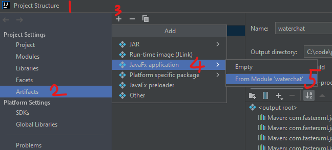
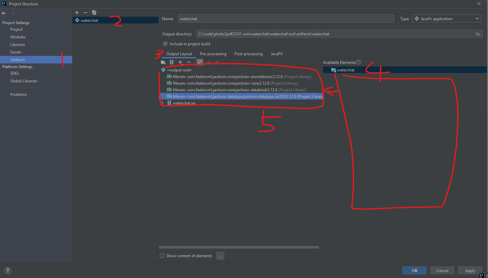
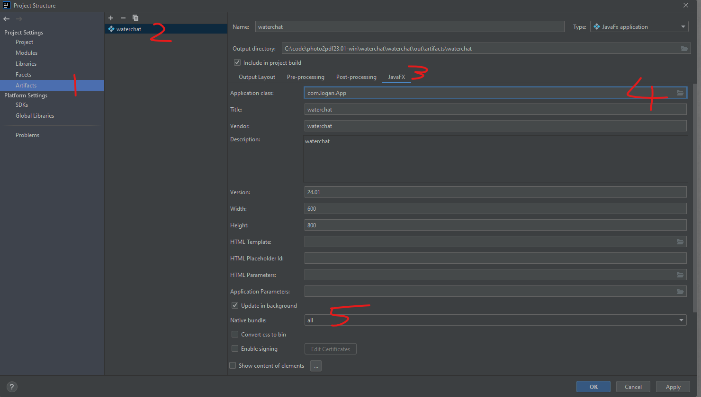
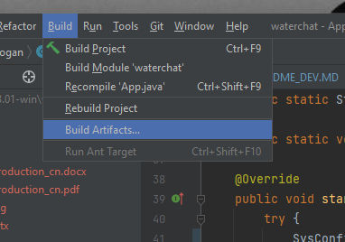
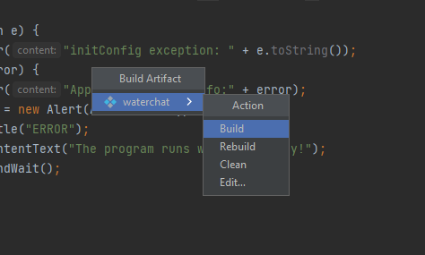

# README_DEV

## 1 环境
* 运行和构建项目环境 -- JDK25（macOS：JDK25(ARM)）, maven3.9.9, IntelliJ IDEA(CE) 2025.2
* 在windows电脑构建可安装 .exe 文件时需要的环境 -- JDK25(x64)
* 以下文件需要您自行下载或者生成,因为github限制了文件大于100MB的文件上传（重要！！！）。
  1. src/main/resources/models/gemma/gemma-3-1b-it-Q4_K_M.gguf，
  需要您到链接 https://huggingface.co/ggml-org/gemma-3-1b-it-GGUF/tree/main 下载gemma-3-1b-it-Q4_K_M.gguf，
  然后放到 src/main/resources/models/gemma/  文件夹之下。
  2. 修改 pom.xml 文件中的：<javafx.platform>win-x64</javafx.platform> 为你的开发环境。
  3. 新引入项目：mvn clean install -U

## 2 构建
### intellij idea 构建项目的配置

注：
 1. 需要将 output layout 中绿色框框中的依赖全部添加到红色框框当中， 如果有特殊的依赖包或者文件可以点击黄色箭头的+按钮添加你的特殊的文件添加到输出的层中（补充：output layout
的设定是将项目所有依赖的包、文件或者其他的东西在打包输出氏一并输出到打包的目标文件当中，如果不再这里指定那么打包出来的文件在运行程序时将会找不到项目中需要的文件而导致程序运行异常）

 2. 如果本项目是在 Mac 上构建build，那么此时在 waterchat/out/artifacts/waterchat/bundles 目录下已经有可以直接在Mac安装使用的 waterchat-26.01.dmg 安装包了。

### 构建项目为 exe 可执行文件(windows)
* Step1:

* Step2:

CMD 窗口执行(命令中的JDK17的路径需要更换为你的具体路径):
set JAVA_HOME="C:/Program Files/Java/jdk-17.0.1

总之要切换到java17的环境下进行后续操作（你也可以直接更改系统JAVA_HOME这些步骤（自行搜索）来切换到JAVA17）。

* Step3:
执行以下命令既可以将exe制作成可安装的exe（需要先安装 wix toolset（自行搜索如何安装，可能需要windos启用某些功能，可能会出现windows缺乏redit..库文件之类的问题，总之自行搜索解决））:  
在 waterchat/out/artifacts/waterchat/bundles 目录下开启命令行窗口（要是java17的环境）执行以下命令  
jpackage -n waterchat --app-image ./waterchat --vendor waterchat --app-version 24.01 --icon ./waterchat/waterchat.ico --dest ./target/build-link-package --temp ./target/build-link-package/temp --win-dir-chooser --win-menu --win-menu-group waterchat --win-shortcut

（这里你可也可能会遇到问题，打包错误，打包出来的exe文件安装失败，安装好了运行却报错error invoking method之类的，总之自行搜索解决。）

* Step4:
编译生成的安装包的保存位置为：
  waterchat/out/artifacts/waterchat/bundles/target/build-link-package/
 然后如同往常安装 windows 软件一样安装 waterchat-24.01.exe 即可使用！

## 3 注意事项
* 请将用用安装在没有中文名称的路径中。
* 所有的配置只要英文，不要有中文，也不要有空格或者中文的标点符号。
* model_name_list 是都是英文逗号分隔的英文字符串，逗号与英文之间不要留有空格。
* model_path=models/gemma
的 model_path 中 models文件夹下的模型参数文件夹名称要和 model_name_list 保持一致。
* config/resourcefilepath.txt 文件中指定了内置模型需要用到的文件，需要将 models文件夹下的每一个模型参数文件都配置，
否则应用运行时会找不到运行模型需要的文件。
* 为mac平台和windows平台打包可执行的安装包时，需要在 文件中使用不同的配置。主要是为了让安装包文件体积小一些。

例如 mac（需要同时配置对应的 modelsexec 文件）: 
modelsexec/=llama-mac-arm64.tar.gz

而 windows（需要同时配置对应的 modelsexec 文件）：
modelsexec/=llama-win-cpu-x64.zip
modelsexec/=llama-win-cpu-arm64.zip
modelsexec/=llama-win-vulkan-x64.zip

llama.cpp的操作说明
下载的版本是：llama-b9716
到Github使用git拉取代码：https://github.com/ggml-org/llama.cpp.git
然后执行以下命令构建执行包：
macOS执行：
cd ~/llama.cpp
rm -rf build-metal

cmake -B build-metal \
-DCMAKE_BUILD_TYPE=Release \
-DCMAKE_OSX_DEPLOYMENT_TARGET=11.0 \
-DGGML_METAL=ON \
-DLLAMA_CURL=ON \
-DLLAMA_SERVER_WEBUI=ON

cmake --build build-metal --config Release -t llama-server -j$(sysctl -n hw.ncpu)

然后将build-metal/bin/目录整体复制到别的地方，并且重命名为：根据 com.logan.waterchat.chat.init.ResourcesFileAppInit.unzipLLaMAFile 里面
定义的名字，重新命名。
修改命名之后，执行命令：tar -czvf llama-mac-arm64.tar.gz ./llama-mac-arm64，得到压缩文件为 llama-xxxx-xxxx.tar.gz。
将压缩好的文件放入src/main/resources/modelsexec文件，替换旧版本的文件，完成llama.cpp的更新。

## 4 兼容的AI模型说明
*本应用应当都能够支持阿里巴巴通义千问 Qwen3 GGUF 类型的 AI 文本对话大模型。

*本应用理论上能兼容（加载运行）所有 GGUF 类型的 AI 文本对话大模型。

## 5 快速添加同类型模型（已有安装本应用在电脑）
* 1找到本应用在电脑上的waterchat文件夹
* 2在 waterchat/resoueces/models/ 创建你模型名称的文件夹，例如 Qwen3-1.7B-GGUF
* 3将你的模型的所有参数文件下载并放到waterchat/resoueces/models/Qwen3-1.7B-GGUF 文件夹里面
* 4更改 waterchat/resoueces/config/config.txt 里的 model_name_list 新增你的模型名称:Qwen3-1.7B-GGUF/Qwen3-1.7B-Q8_0.gguf（英文逗号拼接，不要有空格，需要指定到 xxxx.gguf文件名为止。如果新增的模型有多个gguf文件，例如 Qwen3-235B-A22B-GGUF/Q5_0 模型，它就有数个gguf文件：Qwen3-235B-A22B-Q5_0-00001-of-00006.gguf，Qwen3-235B-A22B-Q5_0-00002-of-00006.gguf，...
等等，则需要指定第一个gguf文件名作为模型名称：Qwen3-235B-A22B-GGUF/Q5_0/Qwen3-235B-A22B-Q5_0-00001-of-00006.gguf）
* 5启动本应用，切换到help页面，选择切换模型为 Qwen3-1.7B-GGUF/Qwen3-1.7B-Q8_0.gguf即可，有时可能需要退出应用再次打开本应用切换模型才能生效。
* 强烈提醒：总之模型要制定到具体的 xxxx.gguf 文件为止。

## 6 llama.cpp启动参数含义
max_new_tokens=4096          # 最大生成Token数量（Transformers/OpenAI风格参数，不是llama.cpp原生命令行参数）

torch_dtype=auto            # 自动选择模型数据类型（FP16/BF16/FP32等），仅PyTorch/Transformers相关

llama_custom_path=*         # 自定义llama.cpp可执行文件路径，通常是某些GUI或启动器的配置项

is_use_vulkan=false         # 是否启用Vulkan后端（true=启用Vulkan，false=不启用）

-ngl=99                     # 将前99层Transformer卸载到GPU执行；99通常表示尽量全部放GPU（层数不足时自动全部卸载）

--temp=0.2                 # Temperature（温度）；越低越确定，越高越随机；0.2适合代码、问答

--top-k=20                 # 每次采样只从概率最高的20个Token中选择；越小越保守

--top-p=0.95               # 核采样（Nucleus Sampling）；保留累计概率达到95%的候选Token

--min-p=0.05               # 最小概率过滤；剔除概率低于最高概率Token的5%的候选Token

-c=2048                    # 上下文窗口大小（Context Size）；模型可记忆的历史Token数量

-n=1024                    # 本次请求最大生成Token数（llama.cpp参数，等价于max_new_tokens）

--presence-penalty=1.2     # 存在惩罚；已经出现过的词再次出现时降低概率，减少重复